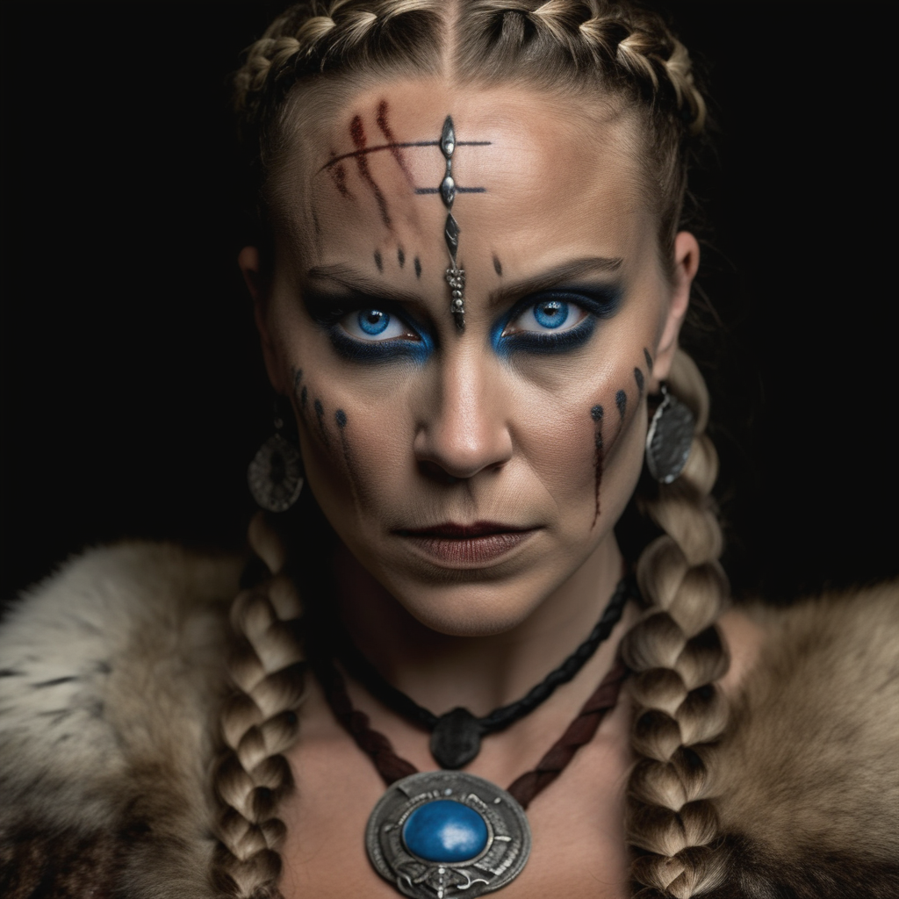

# ThinkDiffusion/ThinkDiffusionXL Cog model

This is an implementation of the [ThinkDiffusion/ThinkDiffusionXL](hhttps://huggingface.co/ThinkDiffusion/ThinkDiffusionXL) as a Cog model. [Cog packages machine learning models as standard containers.](https://github.com/replicate/cog)

First, download the pre-trained weights:

    cog run script/download-weights

Then, you can run predictions:

    cog predict -i prompt="cinematic film still dramatic side lighting, dramatic intense stare closeup portrait, dark black background, hdr, dramatic beautiful warrior woman with warrior face paintings and blood, viking braids, blue eyes, pelt, skull necklace, shallow depth of field, vignette, highly detailed, high budget Hollywood film, cinemascope, moody, epic, gorgeous" -i negative_prompt="anime, cartoon, graphic, text, painting, crayon, graphite, abstract, glitch, blur, bokeh"

## Example:

"cinematic film still dramatic side lighting, dramatic intense stare closeup portrait, dark black background, hdr, dramatic beautiful warrior woman with warrior face paintings and blood, viking braids, blue eyes, pelt, skull necklace, shallow depth of field, vignette, highly detailed, high budget Hollywood film, cinemascope, moody, epic, gorgeous" -i negative_prompt="anime, cartoon, graphic, text, painting, crayon, graphite, abstract, glitch, blur, bokeh"

